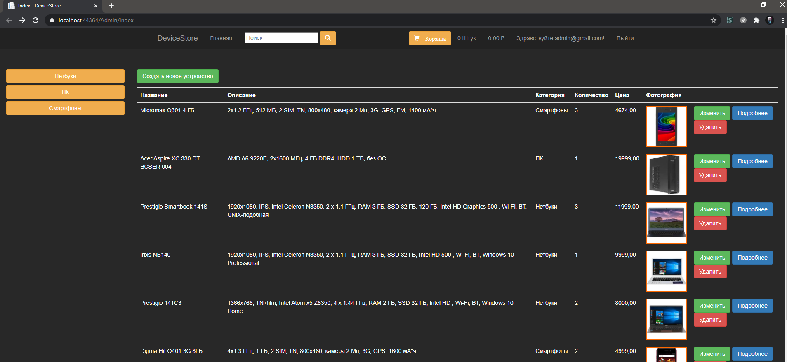
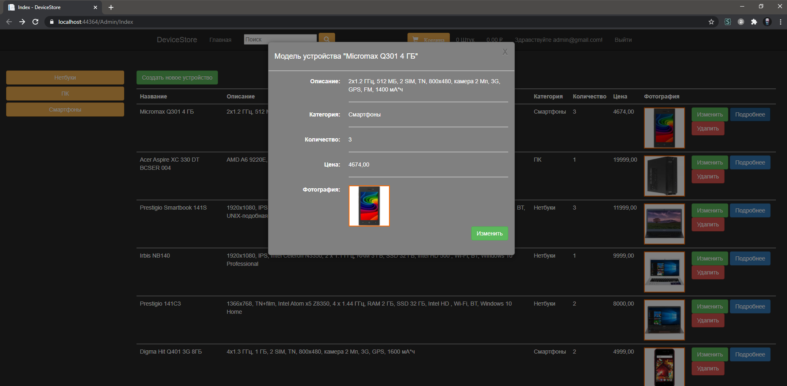
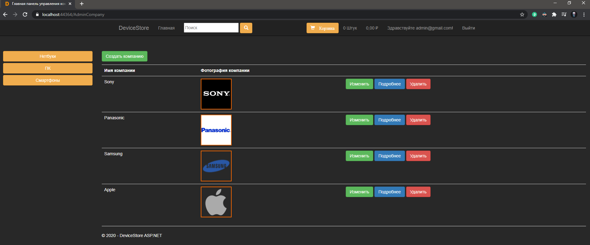
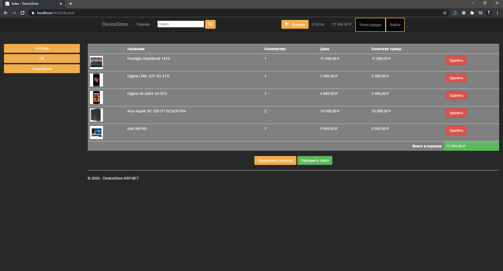

***


## About the project:


_DeviceStore is an online store for selling various devices._

---

## Why the application was created:

_This project was created to study ASP .Net technology. Also, to study MS Sql Server. I did not use the migrations, but created the database and all the logic myself. I learned to use DI and IoC - container (Ninject)._

---

## Technologies:

- ASP .Net (MVC).
- MS Sql Server.
- Ninject 3.
- Bootstrap 3.

---

## How to start:

### 1 way:

##### 1    
Go to the DeviceStore.WebUI / App_Data / folder, find the DeviceStore.mdf file and copy the link to it.
##### 2
Go to Web.config and paste the link into <connectionString>:

``` xml
<connectionStrings>
    <add name="AppDbContext"
         connectionString="Your way for db"
         providerName="System.Data.SqlClient"/>
  </connectionStrings>
```

### 2 way (if 1 way dont work):
#### 1 Create Database in folder DeviceStore.WebUI/App_Data/
#### 2 Open it db
#### 3 Сreate a new request and execute it:
``` sql
Create table Devices
(
    Id nvarchar(50) primary key not null,
    DeviceName nvarchar(50) not null,
    DeviceDescription nvarchar(500) not null,
    DeviceCategory nvarchar(50) not null,	
    DeviceQuantity int not null,
    DeviceFavorites bit default 0 not null,
    DevicePrice decimal(16, 2) not null,
    DeviceImage nvarchar(100) null,
    CompanyId nvarchar(50) null,
);

GO

insert into Devices(Id, DeviceName, DeviceDescription, DeviceCategory, DeviceQuantity, DevicePrice, DeviceImage, CompanyId)
values
('0d99aba4-047b-4ecb-b70c-dd3a50ec5ebe', N'DEXP Aquilon 0163', N'Intel Celeron J3060, 2x1600 МГц, 4 ГБ DDR3, HDD 500 ГБ, Windows 10 домашняя', N'ПК', 3, 14999, N'DEXP_Aquilon_0163.jpg', 'bb862b6a-6928-4f74-9d93-09ef2687afe7'),
('368efead-4e70-43d0-876d-cb204116bfdc', N'Acer Aspire XC 330 DT BCSER 004', N'AMD A6 9220E, 2x1600 МГц, 4 ГБ DDR4, HDD 1 ТБ, без ОС', N'ПК', 1, 19999, N'Acer_Aspire_XC_330_[DT_BCSER_004].jpg', '62aeec13-3d69-46df-b218-b58526efb84f'),
('6377b22f-1e9e-4161-b930-e7f2b3ccf4eb', N'DEXP Aqulion 0220', N'Intel Pentium Silver J5005, 4x1500 МГц, 4 ГБ DDR4, HDD 1 ТБ, без ОС', N'ПК', 2, 17444, N'DEXP_Aqulion_0220.jpg', '62aeec13-3d69-46df-b218-b58526efb84f'),
('66246226-939f-4b4e-ab01-d492b4806559', N'Irbis NB140', N'1920x1080, IPS, Intel Celeron N3350, 2 х 1.1 ГГц, RAM 3 ГБ, SSD 32 ГБ, Intel HD 500 , Wi-Fi, BT, Windows 10 Professional', N'Нетбуки', 1, 9999, N'Irbis_NB140.jpg', '24a7cfa1-a192-4328-8da9-3597835e43de'),
('70b51cc2-6c15-4f2f-b0a9-678b58bc214f', N'Prestigio 141C3', N'1366x768, TN+film, Intel Atom x5 Z8350, 4 х 1.44 ГГц, RAM 2 ГБ, SSD 32 ГБ, Intel HD , Wi-Fi, BT, Windows 10 Home', N'Нетбуки', 2, 8000, N'Prestigio_141C3.jpg', 'bb862b6a-6928-4f74-9d93-09ef2687afe7'),
('77a08fd0-b21e-47c7-a17c-59874e32ca0d', N'Prestigio Smartbook 141S', N'1920x1080, IPS, Intel Celeron N3350, 2 х 1.1 ГГц, RAM 3 ГБ, SSD 32 ГБ, 120 ГБ, Intel HD Graphics 500 , Wi-Fi, BT, UNIX-подобная', N'Нетбуки', 3, 11999, N'Prestigio_Smartbook_141S.jpg', 'a2af3331-cad1-44e1-bcd9-dee81a4da859'),
('bf8ee9a8-99eb-43a2-ad44-e373f1de5590', N'Digma Hit Q401 3G 8ГБ', N'4x1.3 ГГц, 1 ГБ, 2 SIM, TN, 800x480, камера 2 Мп, 3G, GPS, 1600 мА*ч', N'Смартфоны', 2, 4999, N'Digma_Hit_Q401_3G_8ГБ.jpg', 'bb862b6a-6928-4f74-9d93-09ef2687afe7'),
('de582de0-c463-4471-921b-971d70cf8c6f', N'Micromax Q301 4 ГБ', N'2x1.2 ГГц, 512 МБ, 2 SIM, TN, 800x480, камера 2 Мп, 3G, GPS, FM, 1400 мА*ч', N'Смартфоны', 3, 4674, N'Micromax_Q301_4 ГБ.jpg', '62aeec13-3d69-46df-b218-b58526efb84f'),
('e1357d39-2538-45d1-89f0-e83e27f04d4f', N'Digma LINX JOY 3G 4 ГБ', N'4x1.3 ГГц, 512 МБ, 2 SIM, TN, 854x480, камера 2 Мп, 3G, GPS, FM, 2000 мА*ч', N'Смартфоны', 1, 5999, N'Digma_LINX_JOY_3G_4_ГБ.jpg', 'a2af3331-cad1-44e1-bcd9-dee81a4da859');

GO

create table Customers
(
    Id nvarchar(50) primary key not null,
    UserId nvarchar(50),
    FirstName nvarchar(50),
    LastName nvarchar(50),
    City nvarchar(50),
    Street nvarchar(100),
    HouseNumber nvarchar(50),
    ApartmentNumber nvarchar(50),
    PhoneNumber nvarchar(10),
    Email nvarchar(50),
    GiftWrap bit default 0,
);

GO

create table Orders
(
    Id nvarchar(50) primary key not null,
    FirstName nvarchar(100),
    LastName nvarchar(100),
    City nvarchar(100), 
    Street nvarchar(100), 
    HouseNumber nvarchar(100), 
    ApartmentNumber nvarchar(10),
    PhoneNumber nvarchar(100),
    Email nvarchar(100),
    GiftWrap bit default 0,
    OrderStatus nvarchar(100) not null,
);

GO

create table OrderItems
(
    Id nvarchar(50) not null primary key,
    OrderId nvarchar(50),
    DeviceId nvarchar(50),
    DeviceName nvarchar(100),
    Price decimal not null, 
    Image nvarchar(100), 
    Quantity int not null, 
    foreign key (OrderId) references Orders (Id),
);

GO

create table Baskets
(
    Id nvarchar(50) primary key not null,
);

GO

create table BasketItems
(
    Id nvarchar(50) not null primary key,
    BasketId nvarchar(50),
    DeviceId nvarchar(50),
    Quantity int,
    foreign key (BasketId) references Baskets (Id),
);

GO

create table Companies
(
    Id nvarchar(50) not null primary key,
    Name nvarchar(100) not null,
    Image nvarchar(100),
);

GO

insert into Companies(Id, Name, Image)
values
('24a7cfa1-a192-4328-8da9-3597835e43de', 'Sony', 'sony-logo.png'),
('62aeec13-3d69-46df-b218-b58526efb84f', 'Phanasonic', 'panasonic_logo.jpg'),
('a2af3331-cad1-44e1-bcd9-dee81a4da859', 'Samsung', 'samsung.png'),
('bb862b6a-6928-4f74-9d93-09ef2687afe7', 'Apple', 'Apple-logo.png')
```
#### 4 Change connection string in web.config:
``` xml
<connectionStrings>
	<add name="AppDbContext"
         connectionString="Your way for db"
         providerName="System.Data.SqlClient"/>
</connectionStrings>
```

## How to use admin account:

#### 1
Go to the address bar and enter: Admin/Index or AdminCompany/Index (1 for devices 2 for companies)
#### 2
Enter email: admin@gmail.com
Enter password: 123456

You can change in Web.config

``` xml
<add key="adminEmail" value="admin@gmail.com"/>
<add key="adminPassword" value="123456"/>
```

#### How to send check order by email:
Go to the config and enter your email and password (Unreliable applications that have access to the account must be enabled):

``` xml
<!--Your email and password-->
<add key="EmailForSendingTheCheck" value="email"/> <!-- enter to "key"-->
<add key="PasswordForSendingTheCheck" value="password"/>
```
After that, all check orders will be sent to the user by email.

---

## What projects includes:

### The application is divided into 3 parts:

- Domain - the basis. Most of the logic is here.
- Tests - checks how a part of the functional works.
- WebUI - the interface through which it interacts with the user.

---

## Functional:
-  Admin: 
 GRUD system.
 

- Admin company:
CRUD system.
The device has a company


-  Home: 
Gives a list of all products with rotate animation, divided by Pagination, you can also split by categories and find with the use of search.


- Basket: 
A basket with goods is created and deleted automatically (valid for 1 day).


#### Basket functionality:
- View basket contents.
- Add to basket.
- Delete from basket.
- Calculate the sum of the price of goods.
- To order.

---

## Special thanks to:

- Ulyanov-programmer.
https://github.com/Ulyanov-programmer

---

## Plans:

#### UI:
- OrderManager.

#### Admin:
- order management.
- System of discounts.

#### Entities:
- Categories.

#### General:

- User bookmarks.
- System for withdrawing the quantity of goods.

___